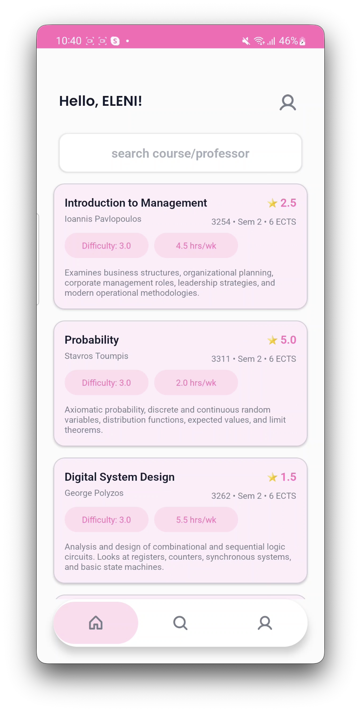
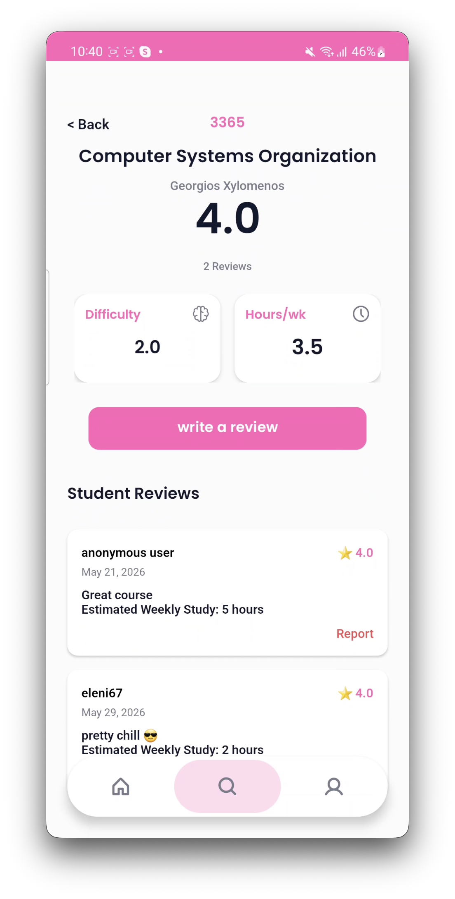
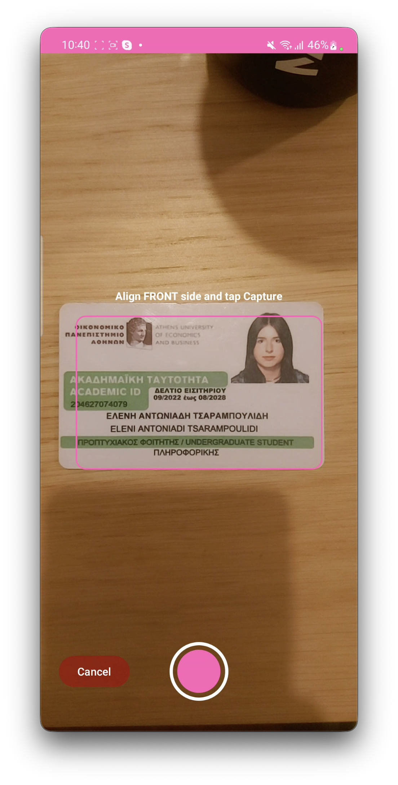
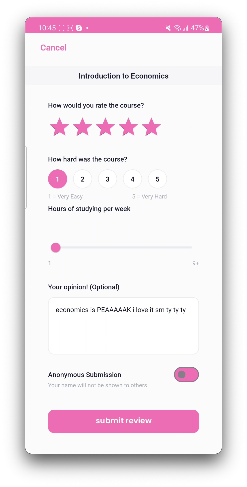
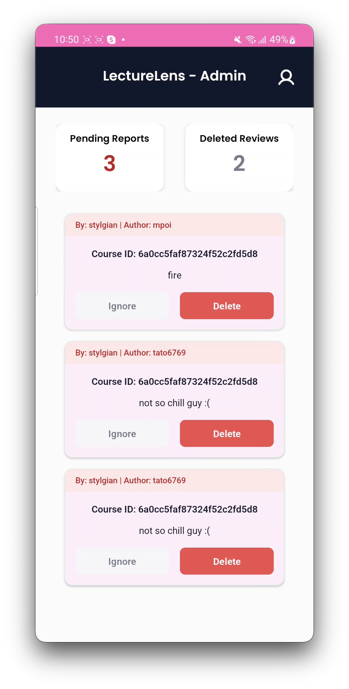
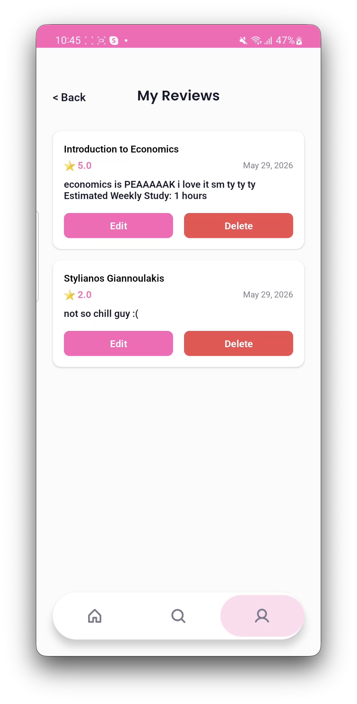

# 🎓 LectureLens

> **A native Android application for university course and professor evaluations, featuring camera OCR text scanning.**

---

## 📽️ Video Demo & Screenshots

| Home & Search | Course & Professor Details | Camera OCR Scanner |
| :---: | :---: | :---: |
|  |  |  |

| Write Review | Admin Moderation | User Profile |
| :---: | :---: | :---: |
|  |  |  |

---

## 🌟 Key Features

* 🔍 **Course & Professor Discovery**: Search and filter academic courses and faculty with real-time ratings and workload statistics.
* 📷 **OCR Syllabus Scanner**: Scan printed syllabus documents or course materials using the device camera for fast course lookups.
* ✍️ **Student Reviews & Feedback**: Submit detailed ratings covering difficulty, weekly hours, and quality of instruction.
* 🛡️ **Content Moderation Dashboard**: Built-in admin panel to process flagged reviews and manage user submissions.
* 🔐 **Session Management**: Secure client-side authentication, session persistence, and password management.

---

## 🛠️ Tech Stack

### **Android Client (Mobile)**
* **Language**: Java
* **UI/UX**: Material Design components, custom drawables, `RecyclerView` Adapters, custom typography (Poppins & Roboto)
* **Architecture**: Activity/Fragment lifecycle management, Model-Adapter separation
* **Device Hardware**: Camera OCR scanner integration

### **Backend Service**
* **Framework**: Spring Boot (Java)
* **Architecture**: RESTful API, MVC architecture, Spring Data JPA Repositories
* **Persistence**: Relational database persistence layer

---

## 📁 Repository Structure

LectureLens/
├── app/                                            # Native Android Client
│   ├── src/main/     
|       ├── java/gr/aueb/lecturelens/               # Activities, Fragments, Adapters, Models
|       ├── res/                                    # Layout XMLs, Drawables, Fonts, Themes
├── backend/                                        # Spring Boot REST API
│   └── src/main/java/gr/aueb/lecturelens/backend   # REST Controllers, JPA Repositories, Models
└── docs/                                           # Documentation & Media Screenshots
